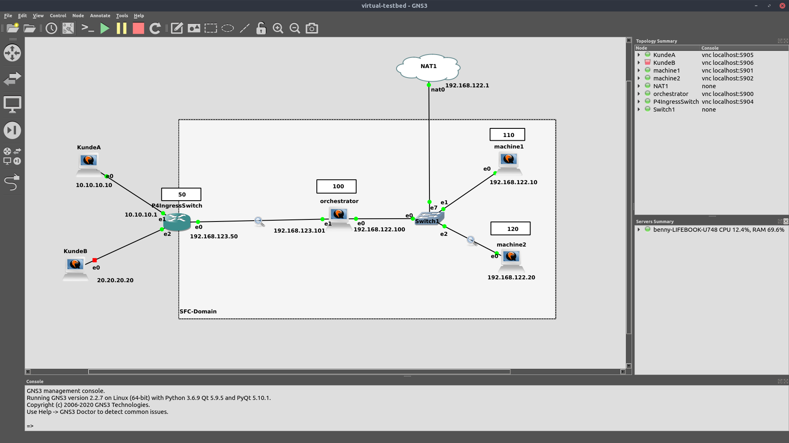

# Simulation Environment (GNS3)

Graphical Network Simulator (GNS3) is a widely used software for simulating complex networks, including routers, switches, virtual machines or containers. 
It allows to quickly spin up and destroy a network infrastructure that can be used for development and testing. Thereby the number of possible devices 
that can be run simultaneously is only limited by the hardware the GNS3 server runs on. GNS3 offers a rich visualization of the simulated infrastructure 
and provides an easy-to-use graphical user interface to interact and configure the devices and links. GNS3 allows to easily link different devices and 
inspect the network flows. A packet capture can be enabled on any link in the network, which allows to analyze the packets with Wireshark from within GNS3. 

## Virtual Testbed
For development and testing it is important to have a network infrastructure which is capable of handling the technologies at hand such as P4 and MPLS-based 
routing. An example network topology that serves as a virtual testbed, built in the GNS3 user interface is shown in the image below.
Setup instructions for the components are provided as well, which should make it easy to build the given infrastructure from scratch.



The nodes are Ubuntu Server 18.04 LTS virtual machines running with QEMU (VM image from https://www.osboxes.org/ubuntu-server/#ubuntu-server-1804-vbox), which are connected to each other via a virtual Ethernet switch or
direct connections. Also, a NAT node is connected to the network, which allows the machines to reach the internet and the GNS3 server, which is running on a regular laptop with Ubuntu 18.04. 


### Setup P4 Ingress Switch BMv2
Spin up a virtual machine to serve as a P4 ingress switch. 
Follow the official installation tutorial (<a href="https://p4.org/p4/getting-started-with-p4.html">Link</a>) to install
the P4 compiler. To install the bmv2 switch with gRPC server, follow the installation instructions in the bmv2 repository
 (<a href="https://github.com/p4lang/behavioral-model/tree/master/targets/simple_switch_grpc">Link</a>).


A P4 program that serves as an implementation for the ingress switch is given as file `../P4 Ingress Switch/ingress-switch.p4`.
To compile the P4 program for the bmv2 software switch, execute:

    p4c -b bmv2 --p4runtime-files ingress-switch.p4info.txt ingress-switch.p4 -o ingress-switch.bmv2

Then, start the P4 software switch:

    sudo simple_switch_grpc --no-p4 -i 0@ens3 -i 1@ens4 -i 2@ens5 -- -- grpc-server-addr 192.168.123.50:50051    


### Setup Orchestrator Node incl. P4Runtime

Install all the dependencies by executing scripts provided in `SFC Orchestrator/dependency-installers/`.
First, execute `sudo root-bootstrap.sh`, then `sudo user-bootstrap.sh`. **Note:** This might take up to few hours.

Alternatively, a dockerized version of the SFC Orchestrator is available. To build the image, cd into the folder
`SFC Orchestrator` and run `docker build --tag orchestrator:1.0 .`.
Then, the SFC Orchestrator can be started with `docker run --name sfc-orchestrator orchestrator:1.0`

Copy ssh key to  `/home/user/.ssh/id_rsa`
### Setup VNF Hosts
**NOTE: Remember to enable MPLS on the sfc nodes.**

```
(On Ubuntu 20.04)

sudo apt install -y qemu-kvm libvirt-daemon-system libvirt-clients bridge-utils

sudo apt install -y lxd (version 3.0.3)

[Set up ssh Key (ssh-copy-id certs/orchestrator.pub <user@vnfhost>]

lxd init

# You must run ‘lxd init’ as root. ‘lxc’ commands can be run as any user who is a member of group lxd. If user joe is not a member of group ‘lxd’, you may run:

# adduser joe lxd
# The following setting should be set for the lxd init command:

# Would you like to use LXD clustering? (yes/no) [default=no]: no
# Do you want to configure a new storage pool? (yes/no) [default=yes]: yes
# Name of the new storage pool [default=default]: default
# Name of the storage backend to use (dir, lvm) [default=dir]: dir
# Would you like to connect to a MAAS server? (yes/no) [default=no]: no
# Would you like to create a new local network bridge? (yes/no) [default=yes]: yes
# What should the new bridge be called? [default=lxdbr0]: lxdbr0
# What IPv4 address should be used? (CIDR subnet notation, “auto” or “none”) [default=auto]: auto
# What IPv6 address should be used? (CIDR subnet notation, “auto” or “none”) [default=auto]: auto
# Would you like LXD to be available over the network? (yes/no) [default=no]: yes
# Address to bind LXD to (not including port) [default=all]: all
# Port to bind LXD to [default=8443]: 8443
# Trust password for new clients: trust
# Again: trust
# Would you like stale cached images to be updated automatically? (yes/no) [default=yes] no
# Would you like a YAML "lxd init" preseed to be printed? (yes/no) [default=no]: no
```

### Configure Ubuntu Server 18.04
**NOTE: This configuration has to be done on every Ubuntu Server node that is added to the network.**

To assign a static IP address to the virtual server and therefore make it reachable from the network,
first disable cloud init by creating an empty file `/etc/cloud/cloud-init.disabled`:

	sudo touch /etc/cloud/cloud-init.disabled

Then, create your own interface configuration by renaming the given configuration file at `/etc/netplan/50-cloud-init.yaml` to `/etc/netplan/01-netcfg.yaml`
and adjusting the configuration:

	sudo mv /etc/netplan/50-cloud-init.yaml /etc/netplan/01-netcfg.yaml

The following configuration assigns IP address *192.168.122.100/24* to the network interface *ens3* 
and sets the address of the default gateway and nameserver to *192.168.122.1*. Also, it assigns
IP address *192.168.123.101* to the interface *ens4*:

	network:
	  version: 2
	  renderer: networkd
	  ethernets:
	    ens3:
	      dhcp4: no
	      addresses: [192.168.122.100/24]   
	      gateway4: 192.168.122.1
	      nameservers:
	         addresses: [192.168.122.1]
	    ens4:
	      addresses: [192.168.123.101/24]

Then, run `sudo netplan apply` to apply the settings.

To activate ssh to the machine, first install the openssh-server and then allow port 22 in the firewall:

	sudo apt install openssh-server
	sudo ufw allow ssh

Now, the server is ready for a remote setup via ssh and reachable from within the network.


### Install bmv2 switch (with grpc) on Ubuntu 18.04
```
sudo apt install \
libjudy-dev \
libreadline-dev \
libtool-bin \
libboost-dev \
libboost-system-dev \
libboost-thread-dev \
automake \
cmake \
libjudy-dev \
libgmp-dev \
libpcap-dev \
libboost-dev \
libboost-test-dev \
libboost-program-options-dev \
libboost-system-dev \
libboost-filesystem-dev \
libboost-thread-dev \
libevent-dev \
libtool \
flex \
bison \
pkg-config \
g++ \
valgrind \
libssl1.0-dev \
libffi-dev \
python-dev \
python-pip \
wget \
autoconf \
make \
unzip 
#build-essential \
#libpcre3-dev \
#libavl-dev \
#libev-dev \
#libprotobuf-c-dev \
#protobuf-c-compiler \
#mv /usr/bin/protoc-c /usr/bin/protoc```

git clone https://github.com/p4lang/behavioral-model.git

cd behavioral-model

sudo sh ./travis/install-nanomsg.sh

sudo sh ./travis/install-nnpy.sh

sudo sh ./travis/install-thrift.sh

cd ..

git clone https://github.com/google/protobuf.git
cd protobuf/
git checkout tags/v3.6.1
git submodule update --init --recursive
./autogen.sh
./configure --prefix=/usr
make
make check
sudo make install
sudo ldconfig
export PKG_CONFIG_PATH=/home/osboxes/protobuf

cd ..

git clone https://github.com/google/grpc.git
cd grpc/
git checkout tags/v1.17.2
git submodule update --init --recursive
make
sudo make install
sudo ldconfig

cd ..

git clone https://github.com/p4lang/PI.git
cd PI
git submodule update --init --recursive
./autogen.sh
./configure --with-proto --without-internal-rpc --without-cli --without-bmv2
make
sudo make install
sudo ldconfig

cd ..

cd behavioral-model
./autogen.sh
./configure --with-pi --without-thrift --disable-logging-macros
make # ca 45min
sudo make install 
sudo ldconfig

cd targets/simple_switch_grpc/
./autogen.sh
./configure
make
sudo make install
```


